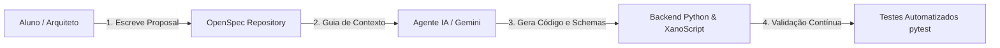
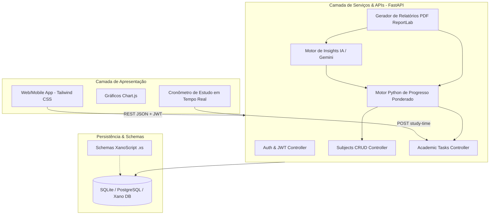

# Documentação Técnica e Acadêmica: EduTrack AI

**Projeto:** EduTrack AI — Assistente Educacional Personalizado  
**Metodologia:** Spec-Driven Development (OpenSpec)  
**Versão:** 1.0.0 (Janeiro / 2026)  
**Autor:** Projeto de Graduação / Curso Superior  

---

## Resumo Executivo
O **EduTrack AI** é uma plataforma acadêmica inteligente projetada para solucionar o problema crítico de sobrecarga, perda de controle de prazos e falta de visibilidade sobre o progresso real em estudantes do ensino superior e técnico. Utilizando a metodologia **Spec-Driven Development (OpenSpec)**, o sistema integra uma interface mobile-first responsiva, um backend robusto em Python (FastAPI / SQLAlchemy), schemas programáticos XanoScript e um motor analítico que pondera o progresso pela carga horária das disciplinas, quantifica desvios entre tempo planejado vs. realizado e gera diagnósticos semanais com Inteligência Artificial e relatórios em PDF.

---

## 1. Introdução e Problema Resolvido

Estudantes universitários frequentemente enfrentam os seguintes desafios:
1. **Falta de visibilidade do progresso ponderado**: Planilhas e listas de afazeres tratam tarefas de disciplinas de 80h com o mesmo peso de disciplinas de 20h, distorcendo a real situação acadêmica do estudante.
2. **Dificuldade na gestão temporal**: Estudantes planejam tempos teóricos de estudo, mas não medem o tempo real despendido, gerando efeito bola de neve e entregas atrasadas.
3. **Ausência de insights inteligentes**: Softwares genéricos são passivos e não orientam sobre gargalos ou reorganização de cronograma.

O EduTrack AI resolve esses problemas unificando:
- Registro de disciplinas com carga horária canônica (`workload_hours`).
- Gestão de tarefas com medição ativa via **Cronômetro de Estudo**.
- **Motor Python de Métricas** com cálculo de desvio percentual de tempo.
- **Módulo de IA & Recomendações** com geração automática de relatórios semanais em PDF.

---

## 2. Metodologia: Spec-Driven Development (OpenSpec)

O projeto foi construído sob o paradigma do **Spec-Driven Development**, dividindo o ciclo de vida em:
- **Arquiteto de Soluções (O Aluno)**: Especifica a intenção do produto, regras de negócio e critérios de aceitação em propostas formais Markdown (`openspec/proposals/`).
- **Agente de IA**: Gera o código executável (Python, XanoScript, SQL, HTML/JS) estritamente aderente às especificações.
- **Documentação Viva**: O histórico evolutivo do projeto reside na pasta `openspec/` com matriz de rastreabilidade em `tasks.md`.

---

## 3. Arquitetura do Sistema

---

## 4. Modelagem de Dados e Nomenclatura Canônica

Todos os nomes de tabelas e campos seguem o padrão canônico **`snake_case`**:

### Tabela `users`
Armazena as contas dos estudantes.
- `id`: Chave primária inteira.
- `name`: Nome completo do aluno.
- `email`: Email institucional/pessoal (índice único).
- `password_hash`: Hash com salt PBKDF2 HMAC SHA-256.
- `created_at`: Data de criação.

### Tabela `subjects`
Armazena as disciplinas cadastradas pelo estudante.
- `id`: Chave primária.
- `user_id`: Chave estrangeira para `users.id` (ON DELETE CASCADE).
- `name`: Nome da matéria (ex.: "Programação em Python & IA").
- `professor`: Nome do docente.
- `workload_hours`: Carga horária total da disciplina em horas.
- `description`: Ementa resumida.
- `start_date` / `end_date`: Período letivo.

### Tabela `academic_tasks`
Armazena as entregas, trabalhos, provas e laboratórios.
- `id`: Chave primária.
- `user_id`: Chave estrangeira para `users.id`.
- `subject_id`: Chave estrangeira para `subjects.id`.
- `title`: Título da atividade.
- `due_date`: Data de entrega.
- `status`: Enumeração (`pending`, `in_progress`, `completed`).
- `estimated_time_minutes`: Tempo planejado em minutos.
- `actual_time_minutes`: Tempo real acumulado via cronômetro.
- `completed_at`: Timestamp de conclusão.

---

## 5. Formulação Matemática das Regras de Negócio

### 5.1 Progresso Ponderado por Carga Horária
$$P_{ponderado} = \frac{\sum_{i=1}^{n} \left( \frac{\text{Tarefas Concluídas}_i}{\text{Total de Tarefas}_i} \times 100 \times \text{Carga Horária}_i \right)}{\sum_{i=1}^{n} \text{Carga Horária}_i}$$

### 5.2 Quantificação de Desvio de Tempo ($D_t$)
$$D_t = \frac{\text{Tempo Real} - \text{Tempo Estimado}}{\text{Tempo Estimado}} \times 100\%$$
- **$D_t \ge +25\%$**: O sistema classifica a disciplina como **gargalo de aprendizagem** e sugere divisão de conteúdo e aumento de horas.
- **$D_t \le -30\%$**: Classificado como **alta eficiência**, sugerindo realocação de tempo livre para disciplinas atrasadas.

### 5.3 Projeção de Velocidade e Data de Término
$$\text{Velocidade (tarefas/semana)} = \frac{\text{Tarefas Concluídas nos últimos 28 dias}}{4}$$
$$\text{Data Estimada} = \text{Hoje} + \left( \frac{\text{Tarefas Pendentes}}{\text{Velocidade}} \times 7 \text{ dias} \right)$$

---

## 6. Módulo de IA & Geração de Relatórios em PDF

O sistema possui uma arquitetura de IA em dois níveis:
1. **Google Gemini 1.5 Flash**: Quando a variável `GEMINI_API_KEY` está presente, o sistema envia o payload analítico estruturado e recebe recomendações pedagógicas em linguagem natural.
2. **Motor Heurístico Local**: Opera offline de forma determinística, garantindo que o sistema nunca falhe caso não haja conexão com a internet ou chave de API.

O endpoint `/api/reports/weekly-pdf` utiliza a biblioteca **ReportLab** para montar dinamicamente um documento de alta resolução contendo:
- Cabeçalho com identificação do aluno.
- KPIs resumidos (Progresso ponderado, horas totais, velocity).
- Tabela analítica de disciplinas com alertas visuais de desvio de tempo.
- Diagnóstico detalhado de IA e checklist de foco para a semana.

---

## 7. Critérios de Aceitação e Validação por Testes

| Critério de Aceitação | Mecanismo de Verificação | Status |
|---|---|---|
| Isolamento Multi-tenant | Usuário só acessa suas próprias disciplinas e tarefas (`test_unauthorized_access_subjects`) | ✅ Aprovado |
| Autenticação Segura | JWT Bearer Tokens e hash PBKDF2 HMAC SHA-256 (`test_password_hashing`, `test_jwt_token_lifecycle`) | ✅ Aprovado |
| Precisão Matemática | Validação das fórmulas de progresso e desvio (`test_calculate_subject_metrics`) | ✅ Aprovado |
| Exportação de Relatórios | Emissão de binário PDF com cabeçalho `application/pdf` (`test_login_and_get_analytics`) | ✅ Aprovado |
| Conformidade OpenSpec | Todas as 20 tarefas do `tasks.md` mapeadas e implementadas | ✅ Aprovado |
