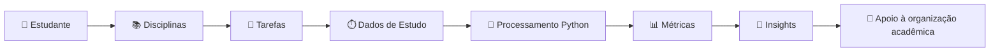
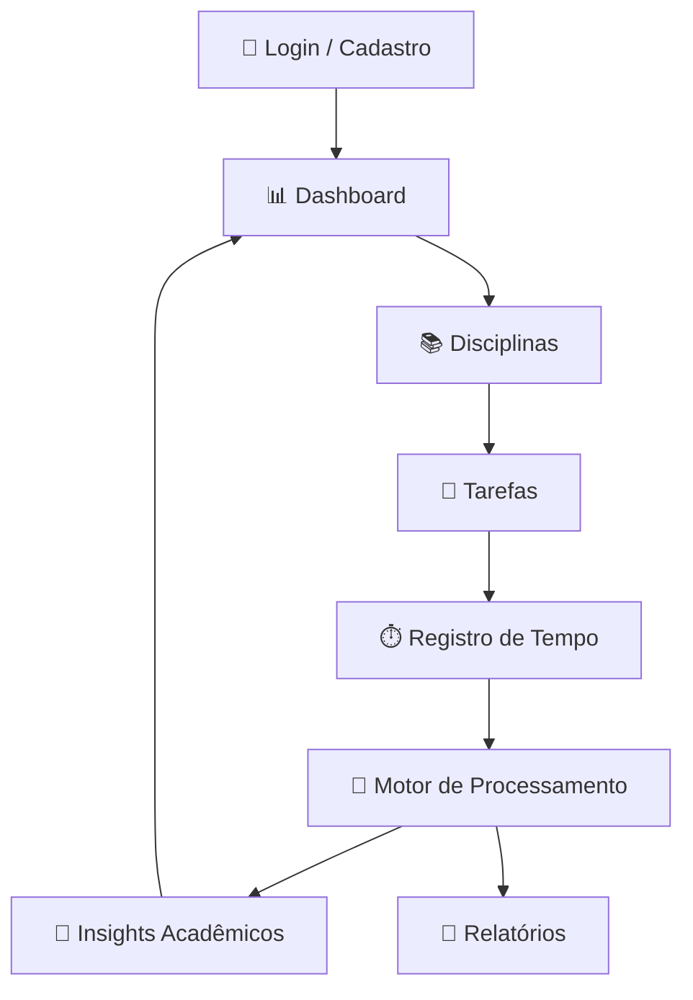
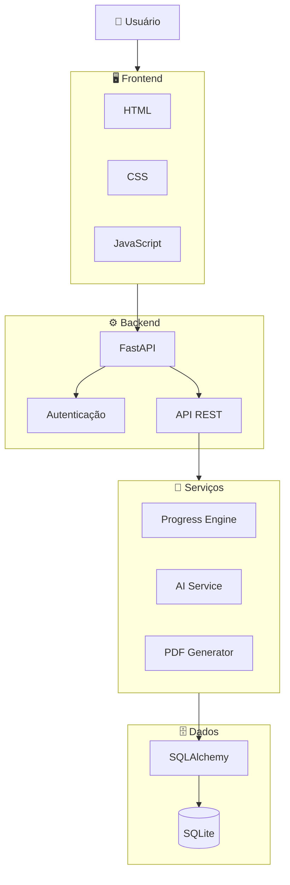
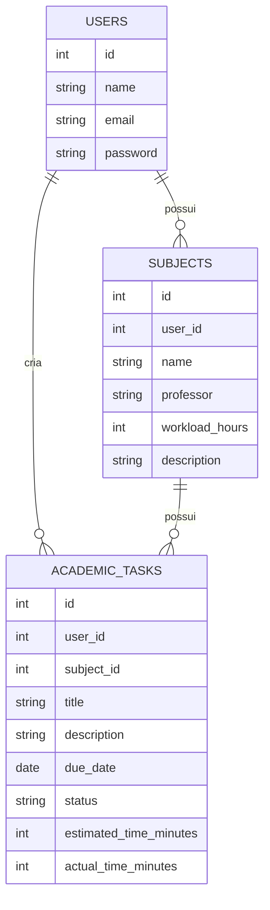
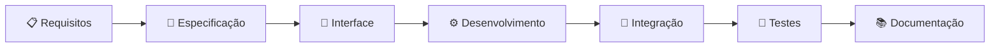

<div align="center">


<br>


<br>


</div>

---

# 📖 Sobre o Projeto

O **EduTrack AI** é uma aplicação acadêmica desenvolvida para auxiliar estudantes no gerenciamento de sua rotina de estudos.

O sistema centraliza informações relacionadas a **disciplinas, tarefas, prazos, progresso e desempenho acadêmico**, permitindo que o estudante tenha uma visão mais clara de sua organização durante o semestre.

A proposta do projeto parte de um problema comum no ambiente acadêmico: estudantes precisam administrar simultaneamente diferentes disciplinas, atividades, prazos e níveis de progresso.

O EduTrack AI busca transformar esses dados em informações organizadas e úteis para apoiar a tomada de decisão durante os estudos.

> 🎓 Projeto desenvolvido no curso de **Ciência da Computação — Faculdade Impacta**.

---

# 🎯 Objetivo

O principal objetivo do EduTrack AI é oferecer uma plataforma capaz de:

- centralizar informações acadêmicas;
- organizar disciplinas;
- gerenciar tarefas;
- acompanhar prazos;
- calcular progresso acadêmico;
- registrar informações relacionadas ao estudo;
- apresentar indicadores de desempenho;
- processar dados acadêmicos;
- gerar recomendações a partir das informações registradas.

---

# 💡 Problema

Durante um semestre acadêmico, um estudante pode precisar administrar simultaneamente:

```text
📚 Diversas disciplinas
       ↓
📝 Trabalhos e atividades
       ↓
📅 Diferentes prazos
       ↓
⏱️ Tempo disponível para estudo
       ↓
📊 Acompanhamento do próprio desempenho
```

Sem uma ferramenta centralizada, essas informações podem acabar distribuídas entre planilhas, aplicativos de notas, calendários e outros sistemas.

O **EduTrack AI** foi desenvolvido para concentrar essas informações em uma única aplicação.

---

# ✨ Funcionalidades

<table>
<tr>
<td width="50%" valign="top">

### 🔐 Autenticação

- Cadastro de usuário
- Login
- Sessão autenticada
- Autenticação utilizando token
- Separação dos dados por usuário
- Fluxo de recuperação de senha em formato de protótipo

</td>

<td width="50%" valign="top">

### 📚 Disciplinas

- Cadastro de disciplinas
- Edição
- Exclusão
- Professor responsável
- Carga horária
- Descrição
- Acompanhamento de progresso

</td>
</tr>

<tr>
<td width="50%" valign="top">

### ✅ Tarefas

- Criação de atividades
- Associação com disciplinas
- Descrição
- Prazo
- Status
- Tempo estimado
- Tempo registrado
- Conclusão de atividades

</td>

<td width="50%" valign="top">

### 📊 Dashboard

- Visão geral da conta
- Quantidade de disciplinas
- Tarefas cadastradas
- Atividades concluídas
- Atividades pendentes
- Progresso geral
- Progresso por disciplina

</td>
</tr>

<tr>
<td width="50%" valign="top">

### ⏱️ Controle de Estudos

- Registro de tempo
- Cronômetro de estudo
- Tempo estimado
- Tempo realizado
- Dados utilizados nas análises acadêmicas

</td>

<td width="50%" valign="top">

### 🧠 Processamento Inteligente

- Cálculo de métricas
- Análise de progresso
- Identificação de prioridades
- Processamento de desempenho
- Geração de insights acadêmicos

</td>
</tr>
</table>

---

# 🧠 Inteligência e Processamento de Dados

Uma das propostas centrais do projeto é não utilizar o backend apenas para armazenamento.

O EduTrack AI possui uma camada de processamento em **Python** responsável por transformar os registros acadêmicos em métricas mais úteis.



Entre os dados que podem ser considerados pelo sistema estão:

- quantidade de tarefas;
- tarefas concluídas;
- tarefas pendentes;
- progresso por disciplina;
- carga horária;
- tempo estimado;
- tempo utilizado;
- ritmo de conclusão.

---

# 🔄 Fluxo Principal



---

# 🏗️ Arquitetura

O projeto foi estruturado separando as principais responsabilidades da aplicação.



---

# 🛠️ Tecnologias

## 🎨 Frontend

| Tecnologia | Utilização |
|---|---|
| HTML5 | Estrutura das páginas |
| CSS3 | Estilização e responsividade |
| JavaScript | Interatividade e integração com API |
| Tailwind CSS | Apoio à construção da interface |
| Three.js | Recursos visuais |
| GSAP | Animações da interface |

---

## ⚙️ Backend

| Tecnologia | Utilização |
|---|---|
| Python | Linguagem principal do backend |
| FastAPI | Construção da API |
| SQLAlchemy | ORM e comunicação com banco |
| Pydantic | Validação e definição de schemas |
| JWT | Autenticação baseada em tokens |

---

## 🗄️ Banco de Dados

| Tecnologia | Utilização |
|---|---|
| SQLite | Persistência local dos dados |
| SQLAlchemy ORM | Manipulação dos registros |

---

## 📐 Especificação e Desenvolvimento

| Tecnologia / Metodologia | Utilização |
|---|---|
| OpenSpec | Desenvolvimento orientado por especificações |
| XanoScript | Artefatos relacionados à especificação do backend |
| Git | Controle de versão |
| GitHub | Colaboração e hospedagem do código |

---

# 📁 Estrutura do Projeto

```text
edutrack/
│
├── 📂 backend/
│   │
│   ├── 📂 app/
│   │   ├── 📂 api/
│   │   ├── 📂 core/
│   │   ├── 📂 models/
│   │   ├── 📂 schemas/
│   │   └── 📂 services/
│   │
│   ├── 📂 tests/
│   └── 📄 requirements.txt
│
├── 📂 frontend/
│   ├── 📂 assets/
│   ├── 📂 css/
│   ├── 📂 js/
│   └── 📄 index.html
│
├── 📂 openspec/
│   ├── 📂 proposals/
│   ├── 📂 xanoscript/
│   └── 📄 tasks.md
│
└── 📄 README.md
```

---

# 🗃️ Modelo de Dados

O sistema trabalha principalmente com três entidades:



As nomenclaturas principais utilizadas seguem:

```text
users
subjects
academic_tasks
```

---

# 📊 Dashboard Acadêmico

O Dashboard funciona como o centro da aplicação.

Ele apresenta uma visão consolidada das informações mais importantes da conta.

### Exemplos de indicadores

```text
┌─────────────────┐
│ 📚 Disciplinas  │
│       XX        │
└─────────────────┘

┌─────────────────┐
│ 📝 Tarefas      │
│       XX        │
└─────────────────┘

┌─────────────────┐
│ ✅ Concluídas   │
│       XX        │
└─────────────────┘

┌─────────────────┐
│ 📈 Progresso    │
│       XX%       │
└─────────────────┘
```

---

# 🔎 Busca e Organização

A aplicação permite organizar tarefas através de diferentes critérios, incluindo:

- pesquisa textual;
- disciplina;
- status;
- organização das atividades cadastradas.

Isso permite encontrar rapidamente atividades específicas dentro da rotina acadêmica.

---

# 📄 Relatórios

O projeto inclui uma camada responsável pela geração de relatórios acadêmicos.

Os relatórios podem consolidar dados como:

- progresso geral;
- informações das disciplinas;
- tarefas acadêmicas;
- métricas calculadas;
- recomendações e indicadores.

---

# 🌓 Interface e Experiência do Usuário

O EduTrack AI foi projetado para oferecer uma interface moderna e organizada.

Entre as características da interface estão:

```text
✓ Layout responsivo
✓ Navegação organizada
✓ Cards informativos
✓ Modais
✓ Tema claro
✓ Tema escuro
✓ Interface adaptável
✓ Feedback visual
✓ Componentes interativos
```

---

# 🚀 Como Executar

## 1️⃣ Clonar o repositório

```bash
git clone URL_DO_REPOSITORIO
```

Depois:

```bash
cd edutrack
```

---

## 2️⃣ Criar ambiente virtual

### Windows

```bash
python -m venv venv
```

Ative o ambiente:

```bash
venv\Scripts\activate
```

### Linux / macOS

```bash
python3 -m venv venv
source venv/bin/activate
```

---

## 3️⃣ Instalar as dependências

```bash
pip install -r backend/requirements.txt
```

---

## 4️⃣ Executar a aplicação

```bash
uvicorn backend.app.main:app --reload
```

---

## 5️⃣ Abrir no navegador

```text
http://localhost:8000
```

---

# 🧪 Testes

O projeto possui uma estrutura de testes automatizados para validação de componentes do backend.

Para executar:

```bash
pytest
```

ou:

```bash
python -m pytest
```

---

# 👥 Equipe

<div align="center">

<table>
<tr>

<td align="center" width="33%">

### 👨‍💻 Luis Felipe

**Desenvolvimento e Integração**

Backend e integração geral do sistema.

</td>

<td align="center" width="33%">

### 👩‍💻 Nicolly Sousa

**Interface e Experiência**

Frontend e organização visual da aplicação.

</td>

<td align="center" width="33%">

### 👩‍💻 Ana Luiza

**Dados e Documentação**

Modelagem, especificações e documentação.

</td>

</tr>
</table>

</div>

---

## 👨‍💻 Luis Felipe

### Principais contribuições

- estruturação geral do projeto;
- desenvolvimento do backend;
- implementação utilizando Python e FastAPI;
- construção das APIs;
- integração frontend/backend;
- autenticação;
- implementação de regras de negócio;
- desenvolvimento das métricas de progresso;
- processamento de dados acadêmicos;
- integração geral das funcionalidades.

---

## 👩‍💻 Nicolly Sousa

### Principais contribuições

- desenvolvimento da interface;
- organização visual das telas;
- estrutura do dashboard;
- estilização dos componentes;
- responsividade;
- experiência do usuário;
- organização das telas de disciplinas;
- organização das telas de tarefas;
- apoio na validação visual da aplicação.

---

## 👩‍💻 Ana Luiza

### Principais contribuições

- apoio à modelagem dos dados;
- organização das informações acadêmicas;
- documentação do projeto;
- estruturação das especificações;
- organização dos requisitos;
- documentação dos fluxos;
- apoio aos testes;
- validação das funcionalidades desenvolvidas.

---

> **Observação:** a divisão acima representa as principais áreas de atuação de cada integrante. O desenvolvimento ocorreu de maneira colaborativa, com participação conjunta em decisões, validações e evolução do projeto.

---

# 🤝 Metodologia de Trabalho

O desenvolvimento do EduTrack AI foi dividido em etapas.



A equipe trabalhou com conceitos relacionados a:

- levantamento de requisitos;
- especificação;
- desenvolvimento frontend;
- desenvolvimento backend;
- modelagem de dados;
- APIs REST;
- autenticação;
- testes;
- documentação;
- controle de versão.

---

# 📚 Contexto Acadêmico

O projeto permite aplicar na prática conhecimentos relacionados a diferentes áreas da Ciência da Computação e Engenharia de Software.

### Conceitos trabalhados

```text
Engenharia de Software
        │
        ├── Requisitos
        ├── Especificações
        ├── Arquitetura
        ├── Versionamento
        └── Testes

Desenvolvimento
        │
        ├── Frontend
        ├── Backend
        ├── APIs REST
        └── Integração

Dados
        │
        ├── Modelagem
        ├── Persistência
        └── Processamento

Inteligência
        │
        ├── Métricas
        ├── Análise
        └── Insights
```

---

# 🔮 Evoluções Futuras

O projeto poderá ser expandido com novas funcionalidades.

- 📱 Aplicativo mobile
- 🔔 Notificações de prazos
- 📅 Calendário acadêmico
- 📧 Recuperação de senha por e-mail
- 🧠 Integrações adicionais com IA
- ☁️ Banco de dados em nuvem
- 📊 Histórico de desempenho
- 📈 Novas visualizações de dados
- 🗓️ Planejamento automático de estudos
- 🎯 Recomendações personalizadas
- 🔄 Sincronização entre dispositivos

---

# 🎓 Aprendizados do Projeto

O desenvolvimento do EduTrack AI permitiu aplicar conceitos de maneira integrada, conectando diferentes componentes de um sistema completo.

Entre os principais pontos trabalhados estão:

- transformar requisitos em funcionalidades;
- estruturar uma aplicação em diferentes camadas;
- integrar frontend e backend;
- construir uma API REST;
- trabalhar com persistência de dados;
- implementar autenticação;
- organizar especificações;
- trabalhar colaborativamente utilizando Git e GitHub;
- documentar decisões e funcionalidades;
- validar um sistema através de testes.

---

# 📌 Informações Acadêmicas

| Informação | Descrição |
|---|---|
| 🎓 Curso | Ciência da Computação |
| 🏫 Instituição | Faculdade Impacta |
| 💻 Projeto | EduTrack AI |
| 📚 Categoria | Projeto Acadêmico |
| 👥 Equipe | Luis Felipe, Nicolly Sousa e Ana Luiza |
| 📅 Ano | 2026 |

---

<div align="center">

## 🎓 EduTrack AI

### Organização acadêmica orientada por dados.

<br>


<br><br>

**Luis Felipe • Nicolly Sousa • Ana Luiza**

<br>


</div>
