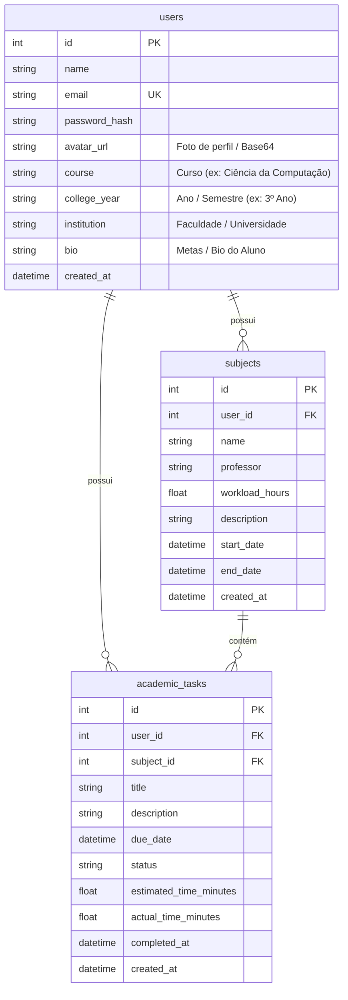

# Especificação de Banco de Dados — EduTrack AI

## Diagrama Entidade-Relacionamento (DER)

## Dicionário de Dados

### Tabela: `users`
| Campo | Tipo | Nulo? | Chave | Descrição |
|---|---|---|---|---|
| `id` | Integer | Não | PK | Identificador único do estudante |
| `name` | String | Não | | Nome completo do estudante |
| `email` | String | Não | UK | Email institucional ou pessoal para login |
| `password_hash` | String | Não | | Hash PBKDF2 HMAC-SHA256 da senha |
| `avatar_url` | Text | Sim | | URL da foto de perfil ou Data URI em Base64 |
| `course` | String | Sim | | Curso de graduação do estudante |
| `college_year` | String | Sim | | Ano letivo ou semestre acadêmico |
| `institution` | String | Sim | | Faculdade ou universidade de vínculo |
| `bio` | Text | Sim | | Biografia e foco acadêmico do aluno |
| `created_at` | DateTime | Não | | Data de cadastro |

### Tabela: `subjects`
| Campo | Tipo | Nulo? | Chave | Descrição |
|---|---|---|---|---|
| `id` | Integer | Não | PK | Identificador único da disciplina |
| `user_id` | Integer | Não | FK | Vínculo com a tabela `users` |
| `name` | String | Não | | Nome da disciplina |
| `professor` | String | Sim | | Nome do professor(a) |
| `workload_hours` | Float | Não | | Carga horária total (usada no cálculo ponderado) |
| `description` | String | Sim | | Ementa ou objetivos da disciplina |
| `start_date` | DateTime | Sim | | Data de início do período letivo |
| `end_date` | DateTime | Sim | | Data de término do período letivo |
| `created_at` | DateTime | Não | | Data de criação |

### Tabela: `academic_tasks`
| Campo | Tipo | Nulo? | Chave | Descrição |
|---|---|---|---|---|
| `id` | Integer | Não | PK | Identificador único da tarefa |
| `user_id` | Integer | Não | FK | Vínculo com a tabela `users` |
| `subject_id` | Integer | Não | FK | Vínculo com a tabela `subjects` |
| `title` | String | Não | | Título da tarefa/atividade |
| `description` | String | Sim | | Detalhes e instruções |
| `due_date` | DateTime | Sim | | Prazo final para entrega |
| `status` | String | Não | | Status: `pending`, `in_progress`, `completed` |
| `estimated_time_minutes` | Float | Não | | Tempo estimado de estudo planejado |
| `actual_time_minutes` | Float | Não | | Tempo real acumulado no cronômetro |
| `completed_at` | DateTime | Sim | | Data e hora de conclusão |
| `created_at` | DateTime | Não | | Data de criação |
